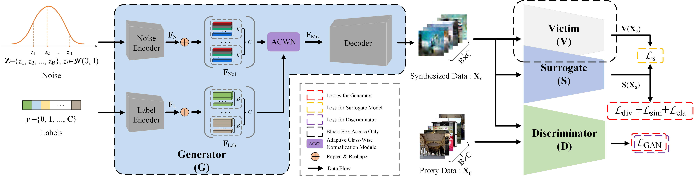

## Exploring Effective Data for Surrogate Training Towards Black-box Attack (CVPR'22)

This repo contains the code for our CVPR 2022 paper "[Exploring Effective Data for Surrogate Training Towards Black-Box Attack](https://openaccess.thecvf.com/content/CVPR2022/html/Sun_Exploring_Effective_Data_for_Surrogate_Training_Towards_Black-Box_Attack_CVPR_2022_paper.html)" by Xuxiang Sun, Gong Cheng, Hongda Li, Lei Pei, and Junwei Han.
> **Abstract:** *Without access to the training data where a black-box victim model is deployed, training a surrogate model for black-box adversarial attack is still a struggle. In terms of data, we mainly identify three key measures for effective surrogate training in this paper. First, we show that leveraging the loss introduced in this paper to enlarge the inter-class similarity makes more sense than enlarging the inter-class diversity like existing methods. Next, unlike the approaches that expand the intra-class diversity in an implicit model-agnostic fashion, we propose a loss function specific to the surrogate model for our generator to enhance the intra-class diversity. Finally, in accordance with the in-depth observations for the methods based on proxy data, we argue that leveraging the proxy data is still an effective way for surrogate training. To this end, we propose a triple-player framework by introducing a discriminator into the traditional data-free framework. In this way, our method can be competitive when there are few semantic overlaps between the scarce proxy data (with the size between 1k and 5k) and the training data. We evaluate our method on a range of victim models and datasets. The extensive results witness the effectiveness of our method.*

<p align="middle">
  
</p>

#### :sparkles: News
**[Jan 17, 2024]**
- Codes updating is underway. The partial codes regarding 'models' are updated.
- 
**[Jan 5, 2024]**
- Codes updating is underway. The partial codes regarding 'data' are updated.

**[Dec 25, 2023]**
- Codes updating is underway. The codes regarding the 'options' of training victim are updated.

**[Dec 06, 2023]**
- Codes updating is underway. The codes regarding 'utils' are updated.

**[Nov 27, 2023]**
- Thanks very much for the attention of peer collages! Next, we plan to gradually update our code. It is expected that the code will be updated completely after **a full review cycle of the extended version of our CVPR work** is reached. Please wait patiently.

#### :blue_book: Citation
If you think this repository may be helpful to you, please consider giving a star :star: and citation. Thanks for your consideration.
```
@inproceedings{sun2022exploring,
  title={Exploring effective data for surrogate training towards black-box attack},
  author={Sun, Xuxiang and Cheng, Gong and Li, Ke and Guo, Lei and Han, Junwei},
  booktitle={Proceedings of the IEEE/CVF Conference on Computer Vision and Pattern Recognition},
  pages={15355--15364},
  year={2022}
}
```
#### :page_facing_up: System Environment

* CUDA: CUDA 11.3
* CUDNN: CUDNN 8.2.1
* Linux: Ubuntu 16.04.7
* gcc/g++: 7.3.0
* Pytorch: 1.12.0
* Python: 3.8.17
* Torchvision: 0.13.0

### :bookmark_tabs: Quick Start
#### 1. Preparing the required packages

To install the python environment, please run:

```
conda env create -f ./stdata.yaml
```

Also, we provide the packages installed via pip. Please refer to `./stdata_pip.txt`.

:point_right: **Tips**
After installing the environment directly, "advertorch" could report an error because of the following code:
```
from torch.autograd.gradcheck import zero_gradients
```
To fix this, simply point to the "advertorch/attacks/fast_adaptive_boundary.py" and comment it out
```
from torch.autograd.gradcheck import zero_gradients
```
Then, search the full text of the file for "zero_gradients" and replace "zero_gradients(x)" with" x.grad.zero_ ()"

#### 2. Preparing datasets
The datasets should be downloaded and formatted in `./datasets` as that in `./datasets_dict/tree.txt`.

#### 3. Training your victims
we provide the codes regarding training your victims. To this end, please run the following command:
```
CUDA_VISIBLE_DEVICES=<gpuid> python ./tools/train_backbone.py --dataroot ./datasets/<data> --model backbone --backbone <net> --niter <e> --batch_size <b> --lr 0.1 --name backbone/<data>_<net>
```
Here, `--name` is to determine where the trained weight of the victim <net> is saved. You should use the above format to set the value of `--name`, or the pre-trained victim could not be found by our code.

After that, the trained weights will be saved at `./checkpoints/backbone/<data>_<net>/latest_net_backbone.pth`, which will be called by the following step.


#### :gift: Acknowledgement
This repo is mainly based on the framework of [pytorch-CycleGAN-and-pix2pix](https://github.com/junyanz/pytorch-CycleGAN-and-pix2pix). Thanks for their great work.
