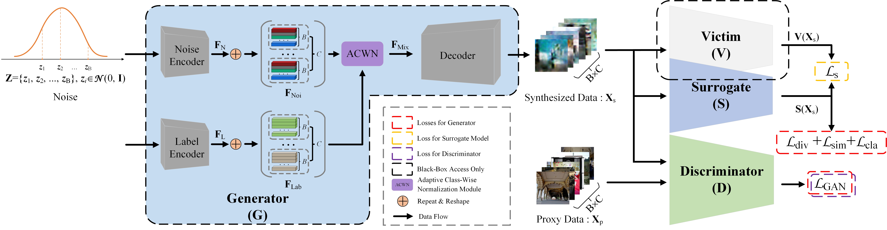

# CVPR 2022: Exploring Effective Data for Surrogate Training Towards Black-box Attack
## **Official** Source Code of the paper "Exploring Effective Data for Surrogate Training Towards Black-box Attack", which is accepted by CVPR 2022.

## System Environment

* CUDA: CUDA 11.0
* CUDNN: CUDNN 8.0.5
* Linux: Ubuntu 16.04.7
* gcc/g++: 5.4.0
* Pytorch: 1.7.0
* Python: 3.8.11
* Torchvision: 0.8.0

## Citation
If you think this repository may be helpful to you, please cite this work.

The main code will be released after the main conference, or be released after the improved version of this paper is accepted.
