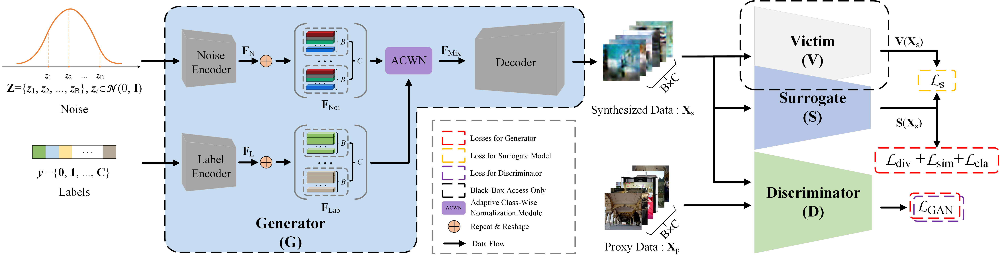

## Data-Free Black-Box Stealing with Cross-Domain Data

This repository contains the code for our CVPR 2022 paper (STDatav1) "[Exploring Effective Data for Surrogate Training Towards Black-Box Attack](https://openaccess.thecvf.com/content/CVPR2022/html/Sun_Exploring_Effective_Data_for_Surrogate_Training_Towards_Black-Box_Attack_CVPR_2022_paper.html)" by Xuxiang Sun, Gong Cheng, Hongda Li, Lei Pei, and Junwei Han.
> **Abstract:** *Without access to the training data where a black-box victim model is deployed, training a surrogate model for black-box adversarial attack is still a struggle. In terms of data, we mainly identify three key measures for effective surrogate training in this paper. First, we show that leveraging the loss introduced in this paper to enlarge the inter-class similarity makes more sense than enlarging the inter-class diversity like existing methods. Next, unlike the approaches that expand the intra-class diversity in an implicit model-agnostic fashion, we propose a loss function specific to the surrogate model for our generator to enhance the intra-class diversity. Finally, in accordance with the in-depth observations for the methods based on proxy data, we argue that leveraging the proxy data is still an effective way for surrogate training. To this end, we propose a triple-player framework by introducing a discriminator into the traditional data-free framework. In this way, our method can be competitive when there are few semantic overlaps between the scarce proxy data (with the size between 1k and 5k) and the training data. We evaluate our method on a range of victim models and datasets. The extensive results witness the effectiveness of our method.*
<p align="middle">
  
</p>

Meanwhile, we include the code for our IEEE T-PAMI 2025 paper (STDatav2) "[STDatav2: Accessing Efficient Black-Box Stealing for Adversarial Attacks](https://ieeexplore.ieee.org/document/10806846)" by Xuxiang Sun, Gong Cheng, Hongda Li, Chunbo Lang, and Junwei Han.

> **Abstract:** *On account of the extreme settings, stealing the black-box model without its training data is difficult in practice. On this topic, along the lines of data diversity, this paper substantially makes the following improvements based on our conference version (dubbed STDatav1, short for Surrogate Training Data). First, to mitigate the undesirable impacts of the potential mode collapse while training the generator, we propose the joint-data optimization scheme, which utilizes both the synthesized data and the proxy data to optimize the surrogate model. Second, we propose the self-conditional data synthesis framework, an interesting effort that builds the pseudo-class mapping framework via grouping class information extraction to hold the class-specific constraints while holding the diversity. Within this new framework, we inherit and integrate the class-specific constraints of STDatav1 and design a dual cross-entropy loss to fit this new framework. Finally, to facilitate comprehensive evaluations, we perform experiments on four commonly adopted datasets, and a total of eight kinds of models are employed. These assessments witness the considerable performance gains compared to our early work and demonstrate the competitive ability and promising potential of our approach.*
<p align="middle">
  
</p>


#### :blue_book: Citation
If you think this repository may be helpful to you, please consider giving a star :star: and citation. Thanks for your consideration.
```
@inproceedings{sun2022exploring,
  title={Exploring effective data for surrogate training towards black-box attack},
  author={Sun, Xuxiang and Cheng, Gong and Li, Hongda and Pei, Lei and Han, Junwei},
  booktitle={Proceedings of the IEEE/CVF Conference on Computer Vision and Pattern Recognition},
  pages={15355--15364},
  year={2022}
}
@article{sun2025stdatav2,
  title={STDatav2: Accessing Efficient Black-Box Stealing for Adversarial Attacks},
  author={Sun, Xuxiang and Cheng, Gong and Li, Hongda and Lang, Chunbo and Han, Junwei},
  booktitle={IEEE Transactions on Pattern Analysis and Machine Intelligence},
  volume={47},
  number={4},
  pages={2429--2445},
  year={2025}
}
```
#### :page_facing_up: System Environment

* CUDA: CUDA 11.3
* CUDNN: CUDNN 8.2.1
* Linux: Ubuntu 16.04.7
* gcc/g++: 7.3.0
* Pytorch: 1.12.1
* Python: 3.7.13
* Torchvision: 0.13.1

### :bookmark_tabs: Quick Start
#### 1. Preparing the required packages

To install the python environment, please run:

```
conda env create -f ./stdata.yaml
```

Also, we provide the packages installed via pip. Please refer to `./stdata_pip.txt`.

:point_right: **Tips**
After installing the environment directly, "advertorch" could report an error because of the following code:
```
from torch.autograd.gradcheck import zero_gradients
```
To fix this, simply point to the "advertorch/attacks/fast_adaptive_boundary.py" and comment it out
```
from torch.autograd.gradcheck import zero_gradients
```
Then, search the full text of the file for "zero_gradients" and replace "zero_gradients(x)" with" x.grad.zero_ ()"

#### 2. Preparing datasets
The datasets should be downloaded and formatted in `./datasets` as that in `./datasets_dict/tree.txt`.

#### 3. Training your victims
we provide the codes regarding training your victims. To this end, please run the following command:
```
CUDA_VISIBLE_DEVICES=<gpuid> python ./tools/train_backbone.py --dataroot ./datasets/<data> --model backbone --backbone <net> --niter <e> --batch_size <b> --lr 0.1 --name backbone/<data>_<net>
```
Here, `--name` is to determine where the trained weight of the victim <net> is saved. You should use the above format to set the value of `--name`, or the pre-trained victim could not be found by our code.

After that, the trained weights will be saved at `./checkpoints/backbone/<data>_<net>/latest_net_backbone.pth`, which will be called by the following step.

#### 4. Training with STDatav1/STDatav2
For the training of STDatav1, run the following command (e.g., for logit-only case):
```
CUDA_VISIBLE_DEVICES=<gpuid> python ./tools/stdatav1.py --dataroot ./datasets/<data> --subroot ./datasets/<proxy> --model stdatav1 --tarmodel <net> --niter <e> --niter_decay <decay> --basebatch <b> --clsbatch <cb> --name stdatav1/<name>
```
Then, the training files (e.g., weights, configs, logs) will be saved at `./checkpoints/stdatav1/<name>`, and the Tensorboard Logs will be saved at `./results/stdatav1/<name>`. In addition, for label-only case, adding "--labonly" as extra parameters. For probability-only case, adding "--nologits" as extra parameters. More information about alternative parameters can be found in `./options/stdatav1_options.py`, where you can customize your settings, such as changing the size of the proxy data and changing the query budget, etc.

For the training of STDatav2, run the following command (e.g., for logit-only case):
```
CUDA_VISIBLE_DEVICES=<gpuid> python ./tools/stdatav2.py --dataroot ./datasets/<data> --subroot ./datasets/<proxy> --model stdatav2 --tarmodel <net> --niter <e> --niter_decay <decay> --batch_size <b> --name stdatav1/<name>
```
Similarly, our users are suggested to check `./options/stdatav2_options.py` for more information regarding the alternative options for customizing your settings.

#### 5. Evaluations
To evaluate the stealing performance, run the following command:
```
CUDA_VISIBLE_DEVICES=<gpuid> python ./tools/eval_st.py --dataroot ./datasets/<data> --model stdatav1 --submodel <sub> --tarmodel <tar> --name <name>
```
Here, `<name>` should be consistent with that in the training stage. Then, it will write the evaluation results in `./results/<name>/<tarflag>_results.txt`, where `{tarflag}` is `uasr` or `tasr`, which represent non-targeted attack and targeted attack, respectively. You can specify this via the parameter `--targeted`. More information can be accessed in `./options/evalst_options.py`.

#### :gift: Acknowledgement
This repo is mainly based on the framework of [pytorch-CycleGAN-and-pix2pix](https://github.com/junyanz/pytorch-CycleGAN-and-pix2pix). Thanks for their great work.
